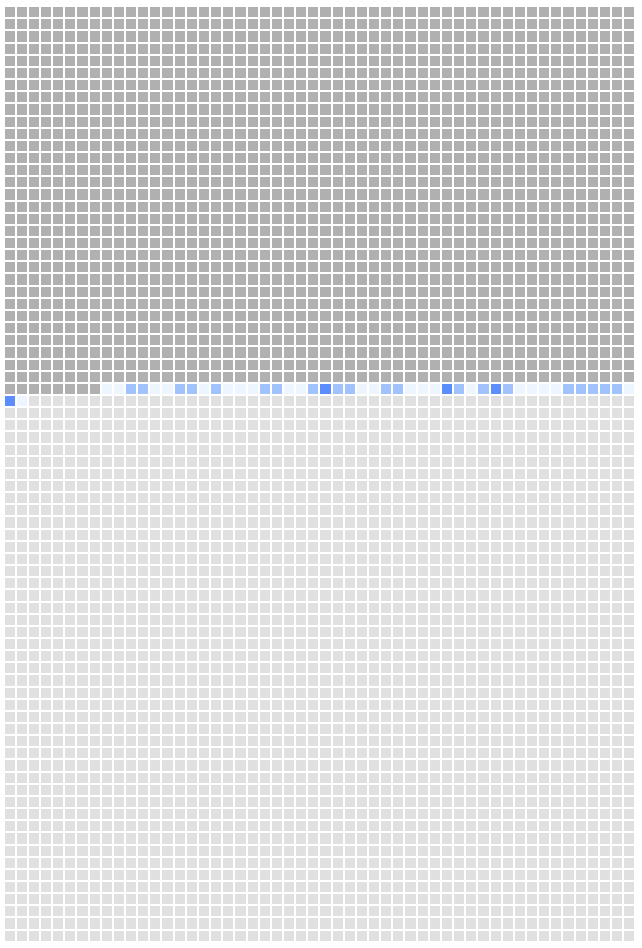

Four thousand weeks. That is it. That is all time we get on this earth. 

I was "inspired" by this [Reddit Post](https://www.reddit.com/r/webdev/comments/1gn24zo/i_probably_only_have_2000_weeks_left_to_live_so_i/).
It is a strong visualization of the four thousand weeks concept. It lets the user put in their name and birthday so they're able to visualize how much time they have left assuming an average lifespan. 
It is morbid in one sense. But I appreciate the author's candor in the comments. That we can face this concept head on and use it to truly prioritize the things that are important in our life. 

I wanted to take it a step further though. Generally visualizations like this are "fun" for a few minutes but you quickly forget about them. I wanted to constantly remind myself of this concept and incorporate it on a regular basis. I had the idea to combine it with Github's heatmap to create something similar to the original posts idea. Instead of your name, you would put your Github user name and it would create a heatmap on a lifetime basis instead of the rolling year that Github normally does. 

However, there were quite a few restrictions I had to work around that eventually lead to just a more personal graphic. 

- First, getting data from Github required investing time into writing a server, hosting it and all the other things having a server entails which in the spirit of this post, I decided I did not feel like doing. 
- Second, the structure of Github's API is not conducive for this either. I would have to request all the user's repos, then individually request all the commits from each repo. I didn't even check if pagination was involved but it surely would be. It'd be a poor user experience waiting for all these subsequent calls and again I didn't want to invest time or money into that aspect. 

Another data source I considered was iPhone's Screen Time data, although this concept would be a lot more depressing! Unfortunately there isn't a public API to access this data either. 

Instead I resigned myself to just using local data. I could preserve the original concept by downloading all my repos and using some git commands to generate a list of commits with dates. It'd work but it also wasn't automated in a way I desired. 

Eventually I settled on using this blog's posts as the data source (sparse as it is... so far). Assuming I regularly write to this blog means the graphic would update "automatically" as a normal part of my workflow, instead of forcing me to run some script to generate the commit date data which I then commit to this site. Maybe I could have had some chron job or something else but I also like the idea of using blog posts instead of commits. Originally, the idea for this blog was to generate more narratives for my life and I plan on blogging about a variety of things rather than just development. Philosophy, media I am consuming... my dogs and family. So I feel it offers a more comprehensive heatmap on whether I am living my life, moreso than the "coldness" of just purely code commits (while it is my vocation and one of my primary hobbies.)

- The dark gray squares represents all the weeks up until my first blog post.
- The blue squares are a heatmap for the amount of blogs (dark blue = 5+, medium blue = 3+, light blue = 1+, lightest blue = 0) between my first blog post and my latest one. 
- The light gray squares represent the weeks to come. 

The other motivation for this post is obvious in light of my most recent posts. I miss my dog. I miss her so much. 
I forget where I read this concept but dogs do not care about what they're doing. 
As long as they get to do it with you, they're having the time of their life. 

I don't want to waste another week... another second, on things that don't matter. I want to spend it, surrounded by the ones I love. 